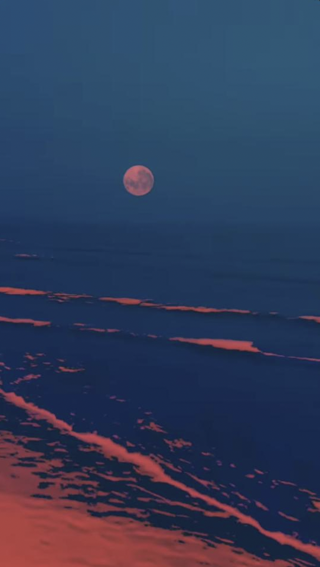

# Astra Mar
### A weather app with a tidal and astrological edge. Built with React and Tailwind.
#### User receives live data relevant to geolocation entered.

## General Plan 
- weather/tidal app with current/upcoming astrological events for user's geographic location or searched location
	- fetch geolocation using api call upon user accessing site (pending user consent) or return based off of input location
	- useContext for global app access to geolocation 
    - useParams for routes to do things on specific pages
    - CSS styling using Tailwind 
	- deployment to GitHub pages

## Data Structures / Models 

- useContext for searched location
 <!--
	- ID (number)
	- title (string)
	- description (string)
	- isCompleted (boolean)
	- due date (JS Date)
	- created at date (JS Date) -->
    

## Development Plan 

#### Plan:
- Establish app functionality and purpose
- Determine general components required and setup app structure
- Assign tasks as required to team
- Be in accordance with Github collaboration style
    - All team members to work off their feature page branch and work on local branches for subcomponents (if necessary)
    - All reusable components to be directly branched off main (i.e. header, footer, etc.)
- Determine design and styling 

#### App Structure and Routes:
- ##### /
    - Homepage
        1. Basic introduction to site
        2. Display 3 or 4 default location tiles showing live weather data (NY, London, Tokyo, Sydney)
        3. Create an input for user's desired location to collect and store their geolocation (upon user consent) (*reusable component across all routes)
        4. Create resuable search input (?option to include a pin drop with interactive map unique to homepage/?googlemaps api) to change/search for a location
        5. Includes resuable navigational header bar and footer
            - Header to contains toggle for dark mode and include NavBar
            - Implement burger menu for mobile/small device screens (?interactive hyperlinks for large screens)
            - Footer to contain copyright to all team members
- ##### /weather
    - Weather page once user enters location (rerender of homepage)
        1. Include resuable search component and/or get user geolocation
        2. Display data from api call of weather 
            - Temperature (max & min)
            - Chance of rain
            - Humidity
            - Other filler data
        3. ?Option for user to select a 14-day or monthly outlook (calendar format) with weather info, moon phase, and tidal info for user planning purposes
- ##### /lunar
    - Astrological events page 
        1. Include resuable search component and/or get user geolocation
        2. Display data from api call of astrological events in user desired location
            - lunar phase
            - lunar sunrise/sunset
        3. Display interesting astro events such as solar or lunar eclipses, planetary visibility, solar flares, etc
        4. ?Option for interactive moon phase icons with enlarged hover for user to learn about each phase

- ##### /tidal
    - Tidal page showing data with visualizer
        1. Include resuable search component and/or get user geolocation
        2. Display data from api call of tidal information
            - High and low tide information (heights/times)
            - Visibility
            - Ocean temperature
            - Wind speed and direction
            - Current strength
        3. Display key marine information such as king tide (to integrate better with lunar aspect, i.e. high tide on a full moon results in a king tide)
        4. Display a visualizer or animation to simulate the tide data changing  (maybe have two arrays of data and toggle between corresponding data points to appear "wavy" (maybe 0-12h, and 12-24h tides))
        5. Show a weekly panel with tidal information (highs and lows with time) to aid in user planning

#### Resuable Components:
- header
    - show title and interactive nav bar
    - use navlinks 
    - houses dark mode toggle
- footer
    - nav bar but slightly reformatted
    - include copyright
- user search input bar
    - Allow user to input location (to be used in Context)

## Design:
- To be determined as components and code bulks out with content to style
>

Additional Features:
- Nice to have:
    - light/dark mode consistent with theme (maybe dark mode represented by moon icon on a slider which changes to sun for light mode)
- Nicer to have:
    - Some form of an animated homepage background that ties into tidal/starry theme

## Sources 

#### APIs:
- Homepage map interactive location search and fetch feature: [Google Maps API](https://developers.google.com/maps/documentation/javascript)
- Weather API for weather page:
[Open-Meteo API](https://open-meteo.com/en/docs)
- Astrological API for lunar page featuring astro events and observations: [DONKI API](https://ccmc.gsfc.nasa.gov/tools/DONKI/)
- Astronomical sunrise/sunset API for lunar page: [Sunrise Sunset API](https://sunrise-sunset.org/api)
- Lunar data API for lunar page: [Moon API](https://rapidapi.com/danylopashuk/api/moon-api1/)
- Tidal data API for tidal page:
[CO-OPS API by NOAA ](https://api.tidesandcurrents.noaa.gov/api/prod/)

#### Other Resources:
- Concept for tidal data visualizer [Steamgraph transition example](https://observablehq.com/@d3/streamgraph-transitions)
